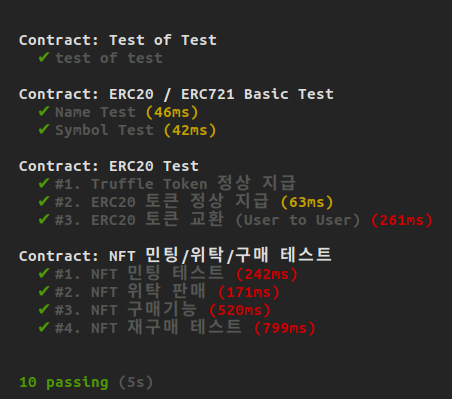

# Incentive Community, Bito

## 프로젝트 소개

1. Home: 글을 쓰고, 포스팅을 할 수 있으며 follow 작업을 할 수 있다.

2. Login: google OAuth 이용한 로그인.

    

3. TokenDetail: NFT 작품의 상세 정보를 확인하고 거래를 할 수 있다.  

4. Create: 이미지를 NFT로 민팅할 수 있다.    

5. Profile: 현재 계정의 정보와 소유한 NFT 작품을 확인할 수 있다.

## Architecture

## 힘들었던 점
 - Truffle 프레임워크에서 Unit Test를 처음 진행해봄

## 

## 기술 스택

## 팀원

|이름|Role|
|---|----|
|박기백 [@parkkibaek](https://github.com/parkkibaek)|팀장|
|김병일 [@DevUreak](https://github.com/DevUreak)|Front|
|서경근 [@Sapphire52000](https://github.com/Sapphire52000)|Front|
|허윤석 [@ysheokorea](https://github.com/ysheokorea)|Backend + Contract|

